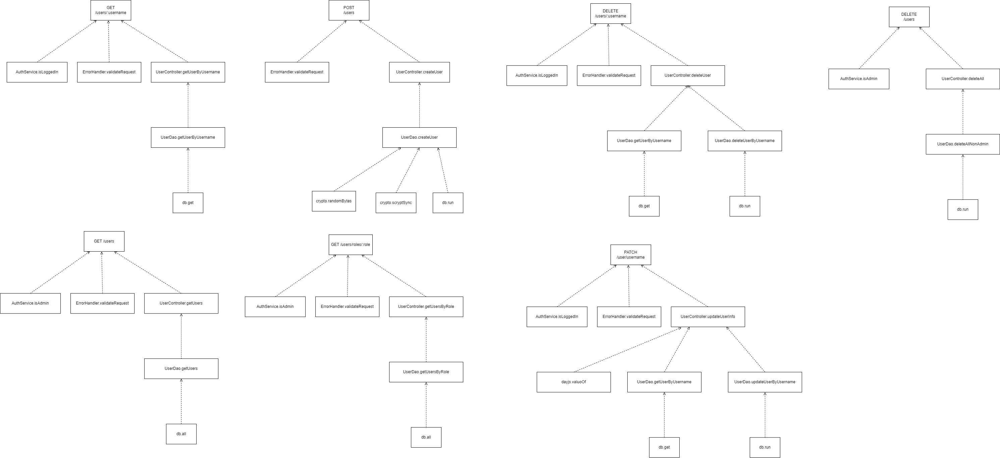
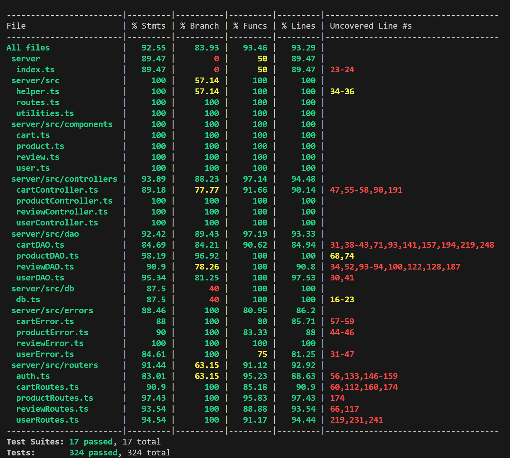

# Test Report

<The goal of this document is to explain how the application was tested, detailing how the test cases were defined and what they cover>

# Contents

- [Test Report](#test-report)
- [Contents](#contents)
- [Dependency graph](#dependency-graph)
- [Integration approach](#integration-approach)
- [Tests](#tests)
- [Coverage](#coverage)
  - [Coverage of FR](#coverage-of-fr)
  - [Coverage white box](#coverage-white-box)

# Dependency graph

     <report the here the dependency graph of EzElectronics>

# Integration approach
<!--
    <Write here the integration sequence you adopted, in general terms (top down, bottom up, mixed) and as sequence

    (ex: step1: unit A, step 2: unit A+B, step 3: unit A+B+C, etc)>

    <Some steps may  correspond to unit testing (ex step1 in ex above)>

    <One step will  correspond to API testing, or testing unit route.js>
-->

    Step 1: Dao Unit tests
      Step 1.1: User Dao Unit tests
      Step 1.2: Product Dao Unit tests
      Step 1.3: Reviews Dao Unit tests
      Step 1.4: Cart Dao Unit tests
    Step 2: Controller Unit tests
      Step 2.1: User Controller Unit tests
      Step 2.2: Product Controller Unit tests
      Step 2.3: Reviews Controller Unit tests
      Step 2.4: Cart Controller Unit tests
    Step 3: Routes Unit tests
      Step 3.1: User Routes Unit tests
      Step 3.2: Product Routes Unit tests
      Step 3.3: Reviews Routes Unit tests
      Step 3.4: Cart Routes Unit tests
    Step 4: Integration tests
      Step 4.1 User Routes + User Controller + User Dao
      Step 4.2 Product Routes + Product Controller + Product Dao
      Step 4.3 Reviews Routes + Reviews Controller + Reviews Dao
      Step 4.4 Cart Routes + Cart Controller + Cart Dao

  The intermediate step Controller + Dao was avoided in the integration tests since most of the controllers simply called the DAO
  

# Tests

<in the table below list the test cases defined For each test report the object tested, the test level (API, integration, unit) and the technique used to define the test case (BB/ eq partitioning, BB/ boundary, WB/ statement coverage, etc)> <split the table if needed>

### UserDAO unit testing
| Test case name | Object(s) tested | Test level | Technique used |
| :------------: | :--------------: | :--------: | :------------: |           
|createUser - It should resolve true| UserDAO | Unit | WB/Statement coverage |
|createUser - it should reject, db call exception| UserDAO | Unit | WB/Statement coverage |
|createUser - it should reject, db error| UserDAO | Unit | WB/Statement coverage |
|getUserByUsername - it should resolve to the correct user| UserDAO | Unit | WB/Statement coverage |
|getUserByUsername - it should reject, db call exception| UserDAO | Unit | WB/Statement coverage |
|getUserByUsername - it should reject, db error| UserDAO | Unit | WB/Statement coverage |
|getUserByUsername - it should reject, user not found| UserDAO | Unit | WB/Statement coverage |
|getUsers - it should resolve to the correct users list| UserDAO | Unit | WB/Statement coverage |
|getUsers - it should reject, db call exception| UserDAO | Unit | WB/Statement coverage |
|getUsers - it should reject, db error| UserDAO | Unit | WB/Statement coverage |
|getUsersByRole - it should resolve to the correct users list| UserDAO | Unit | WB/Statement coverage |
|getUsersByRole - it should reject, db call exception| UserDAO | Unit | WB/Statement coverage |
|getUsersByRole - it should reject, db error| UserDAO | Unit | WB/Statement coverage |
|getUsersByRole - deletedeleteAllNonAdmin test cases| UserDAO | Unit | WB/Statement coverage |
|getUsersByRole - it should resolve to true| UserDAO | Unit | WB/Statement coverage |
|getUsersByRole - it should reject, db call exception| UserDAO | Unit | WB/Statement coverage |
|getUsersByRole - it should reject, db error| UserDAO | Unit | WB/Statement coverage |
|deleteAllNonAdmin - it should resolve to true| UserDAO | Unit | WB/Statement coverage |                                                      
|deleteAllNonAdmin - it should reject, db call exception| UserDAO | Unit | WB/Statement coverage |
|deleteAllNonAdmin - it should reject, db error| UserDAO | Unit | WB/Statement coverage |
|updateUserByUsername - it should resolve to true   | UserDAO | Unit | WB/Statement coverage |
|updateUserByUsername - it should reject, db call exception| UserDAO | Unit | WB/Statement coverage |  
|updateUserByUsername - it should reject, db error | UserDAO | Unit | WB/Statement coverage |

### UserController unit testing
| Test case name | Object(s) tested | Test level | Technique used |
| :------------: | :--------------: | :--------: | :------------: | 
|createUser - It should return true| UserController | Unit       | WB/Statement coverage |
|getUsers - it should resolve to an user list| UserController | Unit       | WB/Statement coverage |
|getUsersByRole - it should resolve to an user list| UserController | Unit       | WB/Statement coverage |
|getUserByUsername - it should resolve to an user list| UserController | Unit       | WB/Statement coverage |
|getUserByUsername - it should resolve to an user list| UserController | Unit       | WB/Statement coverage |
|getUserByUsername - it should reject| UserController | Unit       | WB/Statement coverage |
|deleteUser - it should resolve to true| UserController | Unit       | WB/Statement coverage |
|deleteUser - it should resolve to true| UserController | Unit       | WB/Statement coverage |
|deleteUser - it should reject| UserController | Unit       | WB/Statement coverage |
|deleteUser - it should reject| UserController | Unit       | WB/Statement coverage |
|deleteAll - it should resolve to true| UserController | Unit       | WB/Statement coverage |
|updateUserInfo - it should resolve to the updated user| UserController | Unit       | WB/Statement coverage |
|updateUserInfo - it should resolve to the updated user| UserController | Unit       | WB/Statement coverage |
|updateUserInfo - invalid birthdate, it should reject| UserController | Unit       | WB/Statement coverage |
|updateUserInfo - it should rejest| UserController | Unit       | WB/Statement coverage |
|updateUserInfo - it should rejest| UserController | Unit       | WB/Statement coverage | 

### UserRoute unit testing
| Test case name | Object(s) tested | Test level | Technique used |
| :------------: | :--------------: | :--------: | :------------: | 
|POST/ users - It should return a 200 success code| UserRoute | Unit       | WB/Statement coverage |
|POST/ users - it should return 409 error code| UserRoute | Unit       | WB/Statement coverage |
|POST/ users - it should return 422 error code due to some invalid parameter| UserRoute | Unit       | WB/Statement coverage |
|GET /users - it should return 200 success code| UserRoute | Unit       | WB/Statement coverage |
|GET /users - it should return 401 error code| UserRoute | Unit       | WB/Statement coverage |
|GET /users/:role - it should return 200 success code| UserRoute | Unit       | WB/Statement coverage |
|GET /users/:role - it should return 401 error code| UserRoute | Unit       | WB/Statement coverage |
|GET /users/:username - it should return 200 success code| UserRoute | Unit       | WB/Statement coverage |
|GET /users/:username - it should return 404 error code| UserRoute | Unit       | WB/Statement coverage |
|GET /users/:username - it should return 401 error code| UserRoute | Unit       | WB/Statement coverage |
|DELETE /users/:username - it should return 200 success code| UserRoute | Unit       | WB/Statement coverage |
|DELETE /users/:username - it should return 404 error code| UserRoute | Unit       | WB/Statement coverage |
|DELETE /users/:username - it should return 401 error code| UserRoute | Unit       | WB/Statement coverage |
|DELETE /users/:username - it should return 401 error code| UserRoute | Unit       | WB/Statement coverage |
|DELETE /users/ - it should return 200 success code| UserRoute | Unit       | WB/Statement coverage |                   
|DELETE /users/ - it should return 401 error code| UserRoute | Unit       | WB/Statement coverage |
|PATCH /users/:username - it should return 200 success code| UserRoute | Unit       | WB/Statement coverage |
|PATCH /users/:username - it should return 404 error code| UserRoute | Unit       | WB/Statement coverage |
|PATCH /users/:username - it should return 401 error code| UserRoute | Unit       | WB/Statement coverage |
|PATCH /users/:username - it should return 400 error code| UserRoute | Unit       | WB/Statement coverage |

### User routes integration tests
| Test case name | Object(s) tested | Test level | Technique used |
| :------------- | :--------------- | :--------- | :------------- |
|POST /users - valid request, should return 200 and save a new user in the db| UserRoute + UserController +UserDAO | Integration | BB/eq partitioning |
|POST /users - login as new added user, it should return 200| UserRoute + UserController +UserDAO | Integration | BB/eq partitioning |
|POST /users - Add a Manager, it should return 200| UserRoute + UserController +UserDAO | Integration | BB/eq partitioning |
|POST /users - login as new added manager, it should return 200| UserRoute + UserController +UserDAO | Integration | BB/eq partitioning |
|POST /users - invalid username, should return 422| UserRoute + UserController +UserDAO | Integration | BB/eq partitioning |
|POST /users - invalid name, should return 422  | UserRoute + UserController +UserDAO | Integration | BB/eq partitioning |
|POST /users - invalid surname, should return 422| UserRoute + UserController +UserDAO | Integration | BB/eq partitioning |
|POST /users - invalid password, should return 422| UserRoute + UserController +UserDAO | Integration | BB/eq partitioning |
|POST /users - invalid role, should return 422| UserRoute + UserController +UserDAO | Integration | BB/eq partitioning |
|POST /users - try to post an existing user, should return 409   | UserRoute + UserController +UserDAO | Integration | BB/eq partitioning |                                  
|GET /users - Acces route as admin, it should return all the existring useres| UserRoute + UserController +UserDAO | Integration | BB/eq partitioning |
|GET /users - Acces route as custumer, it should return 401| UserRoute + UserController +UserDAO | Integration | BB/eq partitioning |
|GET /users - Acces route as Manager, it should return 401             | UserRoute + UserController +UserDAO | Integration | BB/eq partitioning |             
|GET /users/roles/:role - Acces route as admin, it should return all the existring useres of a specific role| UserRoute + UserController +UserDAO | Integration | BB/eq partitioning |
|GET /users/roles/:role - Invalid Role, it should return 422| UserRoute + UserController +UserDAO | Integration | BB/eq partitioning |
|GET /users/roles/:role - Acces route as custumer, it should return 401| UserRoute + UserController +UserDAO | Integration | BB/eq partitioning |
|GET /users/roles/:role - Acces route as manager, it should return 401  | UserRoute + UserController +UserDAO | Integration | BB/eq partitioning |           
|GET /users/username - invalid username, it should return 422| UserRoute + UserController +UserDAO | Integration | BB/eq partitioning |
|GET /users/username - access route as admin and request others own information, it should return 200 | UserRoute + UserController +UserDAO | Integration | BB/eq partitioning |
|GET /users/username - access route as customer and request others own information, it should return 200| UserRoute + UserController +UserDAO | Integration | BB/eq partitioning |
|GET /users/username - access route as manager and request others own information, it should return 200| UserRoute + UserController +UserDAO | Integration | BB/eq partitioning |
|GET /users/username - access route as admin and request others information it should return 200| UserRoute + UserController +UserDAO | Integration | BB/eq partitioning |
|GET /users/username - access route as customer and request others information it should return 401| UserRoute + UserController +UserDAO | Integration | BB/eq partitioning |
|GET /users/username - access route as manager and request others information it should return 401| UserRoute + UserController +UserDAO | Integration | BB/eq partitioning |
|GET /users/username - access route as admin and request non existing user it should return 404    | UserRoute + UserController +UserDAO | Integration | BB/eq partitioning |                   
|DELETE /users/username - access router as andmin and delete an other no admin user, it should return 200| UserRoute + UserController +UserDAO | Integration | BB/eq partitioning |
|DELETE /users/username - access router as andmin and delete an other admin user, it should return 401| UserRoute + UserController +UserDAO | Integration | BB/eq partitioning |
|DELETE /users/username - try to delete an non existing user, it should return 404| UserRoute + UserController +UserDAO | Integration | BB/eq partitioning |
|DELETE /users/username - access route as customer and delete own account, it should return 200| UserRoute + UserController +UserDAO | Integration | BB/eq partitioning |
|DELETE /users/username - access route as manager and delete own account, it should return 200| UserRoute + UserController +UserDAO | Integration | BB/eq partitioning |
|DELETE /users/username - access route as admin and delete own account, it should return 200 | UserRoute + UserController +UserDAO | Integration | BB/eq partitioning |                 
|PATCH /users/username - Try to update an non existing user, it should return 404| UserRoute + UserController +UserDAO | Integration | BB/eq partitioning |
|PATCH /users/username - Access router as andmin and update an other non admin user, it should return 200| UserRoute + UserController +UserDAO | Integration | BB/eq partitioning |
|PATCH /users/username - access router as andmin and update an other admin user, it should return 401| UserRoute + UserController +UserDAO | Integration | BB/eq partitioning |
|PATCH /users/username - Access router as andmin and update own account, it should return 200| UserRoute + UserController +UserDAO | Integration | BB/eq partitioning |
|PATCH /users/username - Access router as manager and update own account, it should return 200| UserRoute + UserController +UserDAO | Integration | BB/eq partitioning |
|PATCH /users/username - Access router as customer and update own account, it should return 200| UserRoute + UserController +UserDAO | Integration | BB/eq partitioning |
|PATCH /users/username - invalid name, should return 422| UserRoute + UserController +UserDAO | Integration | BB/eq partitioning |
|PATCH /users/username - invalid surname, should return 422| UserRoute + UserController +UserDAO | Integration | BB/eq partitioning |
|PATCH /users/username - invalid address, should return 422| UserRoute + UserController +UserDAO | Integration | BB/eq partitioning |
|PATCH /users/username - invalid birthdate format, should return 422| UserRoute + UserController +UserDAO | Integration | BB/eq partitioning |
|PATCH /users/username - invalid birthdate is after the current date, should return 400  | UserRoute + UserController +UserDAO | Integration | BB/eq partitioning |                                 
|DELETE /users - access route as admin, it should delete all users non admin users| UserRoute + UserController +UserDAO | Integration | BB/eq partitioning |
|DELETE /users - access route as customer, it should return 401| UserRoute + UserController +UserDAO | Integration | BB/eq partitioning |
|DELETE /users - access route as manager, it should return 401| UserRoute + UserController +UserDAO | Integration | BB/eq partitioning |

### ProductController unit testing
| Test case name | Object(s) tested | Test level | Technique used |
| :------------: | :--------------: | :--------: | :------------: |
| createProduct - It should return undefined        | ProductController | Unit       | WB/Statement coverage |
| createProduct - It should throw DateError         | ProductController | Unit       | WB/Statement coverage  |
| createProduct - It should throw ProductAlreadyExistsError | ProductController | Unit       | WB/Statement coverage  |
| changeProductQuantity - It should return 55       | ProductController | Unit       | WB/Statement coverage  |
| changeProductQuantity - It should reject DateError 1 | ProductController | Unit       | WB/Statement coverage  |
| changeProductQuantity - It should reject DateError 2 | ProductController | Unit       | WB/Statement coverage  |
| changeProductQuantity - It should reject ProductNotFoundError | ProductController | Unit       | WB/Statement coverage  |
| sellProduct - It should return 45                 | ProductController | Unit       | WB/Statement coverage  |
| sellProduct - It should reject DateError          | ProductController | Unit       | WB/Statement coverage  |
| sellProduct - It should reject LowProductStockError | ProductController | Unit       | WB/Statement coverage  |
| sellProduct - It should reject EmptyProductStockError | ProductController | Unit       | WB/Statement coverage  |
| getProducts - It should resolve to a list of three products | ProductController | Unit       | WB/Statement coverage  |
| getProducts - It should resolve to a list of one product (grouped by model) | ProductController | Unit       | WB/Statement coverage  |
| getProducts - It should resolve to a list of one product (grouped by category) | ProductController | Unit       | WB/Statement coverage  |
| getProducts - group=model but model is null -> Error | ProductController | Unit       | WB/Statement coverage  |
| getProducts - group=category but category is null -> Error | ProductController | Unit       | WB/Statement coverage  |
| getProducts - group=model but category is not null -> Error | ProductController | Unit       | WB/Statement coverage  |
| getProducts - group=category but model is not null -> Error | ProductController | Unit       | WB/Statement coverage  |
| getAvailableProducts - It should resolve to a product list | ProductController | Unit       | WB/Statement coverage  |
| getAvailableProducts - It should resolve to a list of one product (grouped by model) | ProductController | Unit       | WB/Statement coverage  |
| getAvailableProducts - It should resolve to a list of one product (grouped by category) | ProductController | Unit       | WB/Statement coverage  |
| getAvailableProducts - group=model but category is not null -> Error | ProductController | Unit       | WB/Statement coverage  |
| getAvailableProducts - group=category but model is not null -> Error | ProductController | Unit       | WB/Statement coverage  |
| getAvailableProducts - group=model but category is not null -> Error | ProductController | Unit       | WB/Statement coverage  |
| getAvailableProducts - group=category but model is not null -> Error | ProductController | Unit       | WB/Statement coverage  |
| deleteAllProducts - It should return true | ProductController | Unit       | WB/Statement coverage  |
| deleteProduct - It should return true | ProductController | Unit       | WB/Statement coverage  |

### ProductDAO unit testing
| Test case name | Object(s) tested | Test level | Technique used |
| :------------: | :--------------: | :--------: | :------------: |
| createProduct - It should return undefined | ProductDAO | Unit | WB/Statement coverage |
| createProduct - It should throw DateError | ProductDAO | Unit | WB/Statement coverage  |
| createProduct - It should throw ProductAlreadyExistsError | ProductDAO | Unit | WB/Statement coverage  |
| updateModel - It should return 55 | ProductDAO | Unit | WB/Statement coverage  |
| updateModel - It should throw ProductNotFoundError | ProductDAO | Unit | WB/Statement coverage  |
| updateModel - It should throw DateError | ProductDAO | Unit | WB/Statement coverage |
| sellModel - It should return 10 | ProductDAO | Unit | WB/Statement coverage |
| sellModel - It should throw ProductNotFoundError | ProductDAO | Unit | WB/Statement coverage |
| sellModel - It should throw DateError | ProductDAO | Unit | WB/Statement coverage |
| sellModel - It should throw EmptyProductStockError | ProductDAO | Unit | WB/Statement coverage |
| sellModel - It should throw LowProductStockError | ProductDAO | Unit | WB/Statement coverage |
| sellModel - It should throw generic Error | ProductDAO | Unit | WB/Statement coverage |
| getAllProducts - It should return a list of products | ProductDAO | Unit | WB/Statement coverage |
| getAllProducts - It should throw ProductNotFoundError | ProductDAO | Unit | WB/Statement coverage |
| getAllProducts - It should throw generic Error | ProductDAO | Unit | WB/Statement coverage |
| deleteAllProducts - It should throw generic Error | ProductDAO | Unit | WB/Statement coverage |
| deleteOneProduct - It should return true | ProductDAO | Unit | WB/Statement coverage |
| deleteOneProduct - It should throw generic Error | ProductDAO | Unit | WB/Statement coverage |
| getProductByModel - It should throw ProductNotFoundError | ProductDAO | Unit | WB/Statement coverage |
| getProductByModel - It should throw generic Error | ProductDAO | Unit | WB/Statement coverage |

### ProductRoute unit testing

| Test case name | Object(s) tested | Test level | Technique used |
| :------------- | :--------------- | :--------- | :------------- |
| POST /products - It should return a 200 success code | ProductRoute | Unit | WB/statement coverage |
| POST /products - It should return a 409 error code | ProductRoute | Unit | WB/statement coverage |
| POST /products - It should return a 400 error code | ProductRoute | Unit | WB/statement coverage |
| PATCH /products/:model - It should return a 200 success code | ProductRoute | Unit | WB/statement coverage |
| PATCH /products/:model - It should return a 400 error code - new arrivalDate before the old one | ProductRoute | Unit | WB/statement coverage |
| PATCH /products/:model - It should return a 400 error code - arrivalDate is in the future | ProductRoute | Unit | WB/statement coverage |
| PATCH /products/:model - It should return a 404 error code - ProductNotFoundError | ProductRoute | Unit | WB/statement coverage |
| PATCH /products/:model/sell - It should return a 200 success code | ProductRoute | Unit | WB/statement coverage |
| PATCH /products/:model/sell - It should return a 404 error code - ProductNotFoundError | ProductRoute | Unit | WB/statement coverage |
| PATCH /products/:model/sell - It should return a 400 error code - DateError - sellingDate in the future | Unit | Integration | WB/statement coverage |
| PATCH /products/:model/sell - It should return a 400 error code - DateError - sellingDate before the arrivalDate | Unit | Integration | WB/statement coverage |
| PATCH /products/:model/sell - It should return a 409 error code - LowProductStockError | ProductRoute | Unit | WB/statement coverage |
| PATCH /products/:model/sell - It should return a 409 error code - EmptyProductStockError | ProductRoute | Unit | WB/statement coverage |
| GET /products - It should return a 200 success code | ProductRoute | Unit | WB/statement coverage |
| GET /products - It should return a 404 error code - ProductNotFoundError | ProductRoute | Unit | WB/statement coverage |
| GET /products - It should return a 422 error code - Grouping null but model and/or category not null | ProductRoute | Unit | WB/statement coverage |
| GET /products - It should return a 422 error code - Grouping = category but category null | ProductRoute | Unit | WB/statement coverage |
| GET /products/available - It should return a 200 success code | ProductRoute | Unit | WB/statement coverage |
| GET /products/available - It should return a 404 error code - ProductNotFoundError | ProductRoute | Unit | WB/statement coverage |
| GET /products/available - It should return a 422 error code - Grouping null but model and/or category not null | ProductRoute | Unit | WB/statement coverage |
| GET /products/available - It should return a 422 error code - Grouping = category but category null | ProductRoute | Unit | WB/statement coverage |
| DELETE /products/:model - It should return a 200 success code | ProductRoute | Unit | WB/statement coverage |
| DELETE /products/:model - It should return a 404 error code | ProductRoute | Unit | WB/statement coverage |
| DELETE /products - It should return a 200 success code | ProductRoute | Unit | WB/statement coverage |
| DELETE /products - It should return a 404 error code | ProductRoute | Unit | WB/statement coverage |

### Product routes integration tests
| Test case name | Object(s) tested | Test level | Technique used |
| :------------- | :--------------- | :--------- | :------------- |
| POST /products - It should return a 200 success code                   | ProductController + ProductDAO + ProductRoute | Integration | BB/eq partitioning     |
| POST /products - It should return a 401 error - Unauthorized           | ProductController + ProductDAO + ProductRoute | Integration | BB/eq partitioning     |
| POST /products - It should return a 400 error - AfterCurrentDateError  | ProductController + ProductDAO + ProductRoute | Integration | BB/eq partitioning     |
| POST /products - It should return a 409 error - ProductAlreadyExistsError| ProductController + ProductDAO + ProductRoute | Integration | BB/eq partitioning     |
| PATCH /products/:model - It should return a 200 success code                   | ProductController + ProductDAO + ProductRoute | Integration | BB/eq partitioning     |
| PATCH /products/:model - It should return a 401 error - Unauthorized           | ProductController + ProductDAO + ProductRoute | Integration | BB/eq partitioning     |
| PATCH /products/:model - It should return a 400 error - AfterCurrentDateError  | ProductController + ProductDAO + ProductRoute | Integration | BB/eq partitioning     |
| PATCH /products/:model - It should return a 404 error                          | ProductController + ProductDAO + ProductRoute | Integration | BB/eq partitioning     |
| PATCH /products/:model - It should return a 400 error - New arrivalDate before old arrivalDate| ProductController + ProductDAO + ProductRoute | Integration | BB/eq partitioning     |
| PATCH /products/:model/sell - It should return a 200 success code and decrease quantity | ProductController + ProductDAO + ProductRoute | Integration | BB/eq partitioning     |
| PATCH /products/:model/sell - It should return a 400 error - AfterCurrentDateError  | ProductController + ProductDAO + ProductRoute | Integration | BB/eq partitioning     |
| PATCH /products/:model/sell - It should return a 400 error - BeforeArrivalDateError | ProductController + ProductDAO + ProductRoute | Integration | BB/eq partitioning     |
| PATCH /products/:model/sell - It should return a 404 error - ProductNotFoundError  | ProductController + ProductDAO + ProductRoute | Integration | BB/eq partitioning     |
| PATCH /products/:model/sell - It should return a 409 error - LowProductStockError   | ProductController + ProductDAO + ProductRoute | Integration | BB/eq partitioning     |
| PATCH /products/:model/sell - It should return a 409 error - EmptyProductStockError | ProductController + ProductDAO + ProductRoute | Integration | BB/eq partitioning     |
| PATCH /products/:model/sell - It should return a 401 error - Unauthorized           | ProductController + ProductDAO + ProductRoute | Integration | BB/eq partitioning     |
| GET /products - It should return a 200 success code and the products  | ProductController + ProductDAO + ProductRoute | Integration | BB/eq partitioning     |
| GET /products - It should return a 200 success code and all the Smartphones| ProductController + ProductDAO + ProductRoute | Integration | BB/eq partitioning     |
| GET /products - It should return a 200 success code and the product    | ProductController + ProductDAO + ProductRoute | Integration | BB/eq partitioning     |
| GET /products - It should return a 422 error code - grouping = model but category is not null | ProductController + ProductDAO + ProductRoute | Integration | BB/eq partitioning     |
| GET /products - It should return a 422 error code - grouping = category but category is null| ProductController + ProductDAO + ProductRoute | Integration | BB/eq partitioning     |
| GET /products - It should return a 404 error code                      | ProductController + ProductDAO + ProductRoute | Integration | BB/eq partitioning     |
| GET /products - It should return a 401 error code - Unauthorized       | ProductController + ProductDAO + ProductRoute | Integration | BB/eq partitioning     |
| GET /products/available - It should return a 200 success code and all the available Smartphone products| ProductController + ProductDAO + ProductRoute | Integration | BB/eq partitioning     |
| GET /products/available - It should return a 200 success code and testmodel      | ProductController + ProductDAO + ProductRoute | Integration | BB/eq partitioning     |
| GET /products/available - It should return a 422 error code - grouping = category but category is null| ProductController + ProductDAO + ProductRoute | Integration | BB/eq partitioning     |
| GET /products/available - It should return a 404 error code                      | ProductController + ProductDAO + ProductRoute | Integration | BB/eq partitioning     |
| DELETE /products/:model - It should return a 200 success code and delete okproduct| ProductController + ProductDAO + ProductRoute | Integration | BB/eq partitioning     |
| DELETE /products/:model - It should return a 404 error code                      | ProductController + ProductDAO + ProductRoute | Integration | BB/eq partitioning     |
| DELETE /products/:model - It should return a 401 error code - Unauthorized       | ProductController + ProductDAO + ProductRoute | Integration | BB/eq partitioning     |
| DELETE /products - It should return a 200 ok code and delete all products | ProductController + ProductDAO + ProductRoute | Integration | BB/eq partitioning     |
| DELETE /products - It should return a 401 error code - Unauthorized       | ProductController + ProductDAO + ProductRoute | Integration | BB/eq partitioning     |
### Review Routes Unit Tests
| Test case name | Object(s) tested | Test level | Technique used |
| :------------- | :--------------- | :--------- | :------------- |
| POST /reviews/:model - It should return a 200 success code                   | Review Routes | Unit Test | WB/statement coverage     |
| POST /reviews/:model - It should return a 404 success code                   | Review Routes | Unit Test | WB/statement coverage     |
| POST /reviews/:model - It should return a 409 success code                   | Review Routes | Unit Test | WB/statement coverage     |
| GET /reviews/:model - It should return a 200 success code                   | Review Routes | Unit Test | WB/statement coverage     |
| GET /reviews/:model - It should return a 401 success code                   | Review Routes | Unit Test | WB/statement coverage     |
| DELETE /reviews/:model - It should return a 200 success code                   | Review Routes | Unit Test | WB/statement coverage     |
| DELETE /reviews/:model - It should return a 404 success code                   | Review Routes | Unit Test | WB/statement coverage     |
| DELETE /reviews/:model - It should return a 404 success code                   | Review Routes | Unit Test | WB/statement coverage     |
DELETE ezelectronics/reviews/:model/all - It should return a 200 success code                   | Review Routes | Unit Test | WB/statement coverage     |
DELETE ezelectronics/reviews/:model/all - It should return a 404 success code                   | Review Routes | Unit Test | WB/statement coverage     |
DELETE ezelectronics/reviews/ - It should return a 200 success code                   | Review Routes | Unit Test | WB/statement coverage     |
DELETE ezelectronics/reviews/ - It should return a 401 success code                   | Review Routes | Unit Test | WB/statement coverage     |
### Review Controller Unit Tests
| Test case name | Object(s) tested | Test level | Technique used |
| :------------- | :--------------- | :--------- | :------------- |
| addReview - It should add a review        | ReviewController | Unit       | WB/statement coverage |
| getProductReviews - It should return reviews of a product        | ReviewController | Unit       | WB/statement coverage |
| deleteReview - It should delete a user's review of a product        | ReviewController | Unit       | WB/statement coverage |
| deleteReviewsOfProduct - It should delete all reviews of a product        | ReviewController | Unit       | WB/statement coverage |
| deleteAllReviews - It should delete all reviews        | ReviewController | Unit       | WB/statement coverage |

### ReviewDAO Unit Tests
| Test case name | Object(s) tested | Test level | Technique used |
| :------------- | :--------------- | :--------- | :------------- |
| addReview - It should add a new review | ReviewDAO | Unit | WB/statement coverage |
| addReview - It should handle product not found error | ReviewDAO | Unit | WB/statement coverage |
| addReview - It should handle product not found error when the product does not exist | ReviewDAO | Unit | WB/statement coverage |
| addReview - It should handle existing review error | ReviewDAO | Unit | WB/statement coverage |
| addReview - It should handle database error | ReviewDAO | Unit | WB/statement coverage |
| addReview - It should handle database error when product exists | ReviewDAO | Unit | WB/statement coverage |
| addReview - It should handle database error when review exists | ReviewDAO | Unit | WB/statement coverage |
| GetProductReviews - It should get product reviews | ReviewDAO | Unit | WB/statement coverage |
| GetProductReviews - It should return empty array if there is no review | ReviewDAO | Unit | WB/statement coverage |
| GetProductReviews - It should handle database error | ReviewDAO | Unit | WB/statement coverage |
| GetProductReviews - It should handle database error when product exists | ReviewDAO | Unit | WB/statement coverage |
| GetProductReviews - It should handle database error when review exists | ReviewDAO | Unit | WB/statement coverage |
| deleteReview - It should delete a user's review of a product | ReviewDAO | Unit | WB/statement coverage |
| deleteReview - It should handle product not found error | ReviewDAO | Unit | WB/statement coverage |
| deleteReview - It should handle product not found error when the product does not exist | ReviewDAO | Unit | WB/statement coverage |
| deleteReview - It should handle no ReviewProduct error | ReviewDAO | Unit | WB/statement coverage |
| deleteReview - It should handle database error | ReviewDAO | Unit | WB/statement coverage |
| deleteReview - It should handle database error when product exists | ReviewDAO | Unit | WB/statement coverage |
| deleteReview - It should handle database error when review exists | ReviewDAO | Unit | WB/statement coverage |
| deleteReviewsOfProduct - It should delete all reviews of a product | ReviewDAO | Unit | WB/statement coverage |
| deleteReviewsOfProduct - It should handle product not found error | ReviewDAO | Unit | WB/statement coverage |
| deleteReviewsOfProduct - It should handle database error | ReviewDAO | Unit | WB/statement coverage |
| deleteReviewsOfProduct - It should handle database error when product exists | ReviewDAO | Unit | WB/statement coverage |
| deleteAllReviews - It should delete all reviews | ReviewDAO | Unit | WB/statement coverage |
| deleteAllReviews - It should handle database error | ReviewDAO | Unit | WB/statement coverage |

### Review Routes Integration Tests 

| Test case name | Object(s) tested | Test level | Technique used |
| :------------- | :--------------- | :--------- | :------------- |
| POST ezelectronics/reviews/:model - It should return a 200 success code | ReviewRoute + ReviewController +ReviewDAO | Integration | BB/eq partitioning |
| GET ezelectronics/reviews/:model - It should return a 200 success code | ReviewRoute + ReviewController +ReviewDAO | Integration | BB/eq partitioning |
| DELETE ezelectronics/reviews/:model - It should return a 200 success code | ReviewRoute + ReviewController +ReviewDAO | Integration | BB/eq partitioning |
| DELETE ezelectronics/reviews/:model/all - It should return a 200 success code | ReviewRoute + ReviewController +ReviewDAO | Integration | BB/eq partitioning |
| DELETE ezelectronics/reviews - It should return a 200 success code | ReviewRoute + ReviewController +ReviewDAO | Integration | BB/eq partitioning |

### CartDAO unit testing
| Test case name | Object(s) tested | Test level | Technique used |
| :------------: | :--------------: | :--------: | :------------: |           
|getCart - should resolve with a Cart object when an unpaid cart is found| CartDAO | Unit | WB/Statement coverage |
|getCart - should reject when no unpaid cart is found| CartDAO | Unit | WB/Statement coverage |
|getCart - should reject with an error if an error occurs during retrieving the cart| CartDAO | Unit | WB/Statement coverage |
|checkoutCart - should resolve true when cart is checked out successfully| CartDAO | Unit | WB/Statement coverage |
|checkoutCart - should reject with an error if an error occurs during checkout| CartDAO | Unit | WB/Statement coverage |
|getCustomerCarts - should resolve with an array of Cart objects when customer carts are retrieved successfully| CartDAO | Unit | WB/Statement coverage |
|checkoutCart - should reject with an error if an error occurs during retrieving customer carts| CartDAO | Unit | WB/Statement coverage |
|checkoutCart - should reject with CartNotFoundError if no customer carts are found| CartDAO | Unit | WB/Statement coverage |
|updateCurrentCart - should resolve true when cart is updated successfully| CartDAO | Unit | WB/Statement coverage |
|updateCurrentCart - should reject with an error if an error occurs during update| CartDAO | Unit | WB/Statement coverage |
|createCurrentCart - should resolve true when cart is created successfully| CartDAO | Unit | WB/Statement coverage |
|clearCart - should resolve true when cart is cleared successfully| CartDAO | Unit | WB/Statement coverage |
|clearCart - should reject with an error if an error occurs during clearing cart| CartDAO | Unit | WB/Statement coverage |
|deleteAllCarts - should resolve true when all carts are deleted successfully| CartDAO | Unit | WB/Statement coverage |
|deleteAllCarts - should reject with an error if an error occurs during deleting carts| CartDAO | Unit | WB/Statement coverage |
|getAllCarts - should resolve with an array of Cart objects when carts are retrieved successfully| CartDAO | Unit | WB/Statement coverage |
|getAllCarts - should reject with an error if an error occurs during retrieving carts| CartDAO | Unit | WB/Statement coverage |
|getAllCarts - should reject with CartNotFoundError if no carts are found| CartDAO | Unit | WB/Statement coverage |

### CartController unit testing 
| Test case name | Object(s) tested | Test level | Technique used |
| :------------: | :--------------: | :--------: | :------------: | 
|getCart - It should return the cart for the logged in user| CartController | Unit       | WB/Statement coverage |
|checkoutCart - It should successfully checkout the cart for the logged in user| CartController | Unit       | WB/Statement coverage |
|checkoutCart - It should throw LowProductStockError if a product has insufficient stock| CartController | Unit       | WB/Statement coverage |
|checkoutCart - It should throw EmptyProductStockError if a product is out of stock| CartController | Unit       | WB/Statement coverage |
|getCustomerCarts - It should return the carts for the logged in user| CartController | Unit       | WB/Statement coverage |
|addtoCart - It should successfully remove a product from the cart| CartController | Unit       | WB/Statement coverage |
|addtoCart - It should remove the product completely if the quantity is 1| CartController | Unit       | WB/Statement coverage |
|removeProductFromCart - It should remove one quantity of the product from the cart| CartController | Unit       | WB/Statement coverage |
|clearCart - It should clear the cart for the logged-in customer| CartController | Unit       | WB/Statement coverage |
|deleteAllCarts - It should delete all carts| CartController | Unit       | WB/Statement coverage |
|deleteAllCarts - It should handle errors when trying to delete all carts| CartController | Unit       | WB/Statement coverage |
|getAllCarts - It should return all carts| CartController | Unit       | WB/Statement coverage |
|getAllCarts - It should handle errors when trying to get all carts| CartController | Unit       | WB/Statement coverage |

### CartRoute unit testing
| Test case name | Object(s) tested | Test level | Technique used |
| :------------: | :--------------: | :--------: | :------------: | 
|GET /carts - It should return a 200 success code| CartRoute | Unit       | WB/Statement coverage |
|POST /carts - should add a product to the cart| CartRoute | Unit       | WB/Statement coverage |
|POST /carts - should return 409 error code if product is already in the cart| CartRoute | Unit       | WB/Statement coverage |
|PATCH /carts - should checkout the cart| CartRoute | Unit       | WB/Statement coverage |
|PATCH /carts - should checkout the cart| CartRoute | Unit       | WB/Statement coverage |
|PATCH /carts - should checkout the cart| CartRoute | Unit       | WB/Statement coverage |
|GET /carts/history - should get the customer's cart history| CartRoute | Unit       | WB/Statement coverage |
|DELETE /carts/products/:model - should remove a product from the cart| CartRoute | Unit       | WB/Statement coverage |
|DELETE /carts/current - should clear the current cart| CartRoute | Unit       | WB/Statement coverage |
|DELETE /carts/current - should clear the current cart| CartRoute | Unit       | WB/Statement coverage |
|DELETE /carts - should delete all carts| CartRoute | Unit       | WB/Statement coverage |
|GET /carts/all - should get all carts| CartRoute | Unit       | WB/Statement coverage |

### Cart Routes Integration Tests 

| Test case name | Object(s) tested | Test level | Technique used |
| :------------- | :--------------- | :--------- | :------------- |
|POST /carts - create and add product, should resolve to 200| CartRoute + CartController + CartDAO | Integration | BB/eq partitioning |
|POST /carts - try to add a non existing product, should resolve to 404| CartRoute + CartController + CartDAO | Integration | BB/eq partitioning |
|POST /carts - try to add a non avaiable product, should resolve to 409| CartRoute + CartController + CartDAO | Integration | BB/eq partitioning |
|GET /carts - View information of the current cart, should resolve 200| CartRoute + CartController + CartDAO | Integration | BB/eq partitioning |
|GET /carts/all - View information of the current cart, should resolve 200| CartRoute + CartController + CartDAO | Integration | BB/eq partitioning |
|DELETE /carts/products/:model - Try to remove a non present product, should reject 404| CartRoute + CartController + CartDAO | Integration | BB/eq partitioning |
|DELETE /carts/products/:model - Try to remove a non existent product, should reject 404| CartRoute + CartController + CartDAO | Integration | BB/eq partitioning |
|DELETE /carts/products/:model - Try to remove a product, should resolve 200| CartRoute + CartController + CartDAO | Integration | BB/eq partitioning |
|PATCH /carts - try to pay empty cart, should resolve 400| CartRoute + CartController + CartDAO | Integration | BB/eq partitioning |
|PATCH /carts - pay for the current cart, should resolve 200| CartRoute + CartController + CartDAO | Integration | BB/eq partitioning |
|PATCH /carts - try to pay non existent cart, should resolve 404| CartRoute + CartController + CartDAO | Integration | BB/eq partitioning |
|GET /carts/history - get cart history, should resolve 200| CartRoute + CartController + CartDAO | Integration | BB/eq partitioning |
|DELETE /carts/products/:model - Try to remove a product from a non existing cart, should reject 404| CartRoute + CartController + CartDAO | Integration | BB/eq partitioning |
|DELETE /carts/current - delete current cart, should resolve 200| CartRoute + CartController + CartDAO | Integration | BB/eq partitioning |
|DELETE /carts/current - try to delete an non existing current, should reject 404| CartRoute + CartController + CartDAO | Integration | BB/eq partitioning |
|DELETE /carts - delete current cart, should resolve 200| CartRoute + CartController + CartDAO | Integration | BB/eq partitioning |
|scenario 10.3 - Add a product to the cart| CartRoute + CartController + CartDAO | Integration | BB/eq partitioning |
|scenario 10.6 - Pay for the current cart| CartRoute + CartController + CartDAO | Integration | BB/eq partitioning |
|scenario 10.1 - View information of the current cart| CartRoute + CartController + CartDAO | Integration | BB/eq partitioning |

# Coverage

## Coverage of FR
<!--
<Report in the following table the coverage of functional requirements and scenarios(from official requirements) >
-->

| Functional Requirement and scenarios  | Test(s) |
| :--------------------------------: | :-----: |
|**FR1.3 Create a new user account**| **7**|
|Scenario 3.1 Registration| 1|
|Scenario 3.2 Username already in use| 1|
|Scenario 3.3 User provides empty parameters| 5|
| **FR2.1 Show the list of all users**             |     **3**    |
| **FR2.2 Show the list of all users with a specific role**                |     **4**    |
| **FR2.3 Show the information of a single user**             |    **8**     |
|Scenario 4.1 View the information of one user| 7|
|Scenario 4.2 Ask to view information of a user who does not exist| 1|
|Scenario 4.3 View the information of all users| 3|
|Scenario 4.4 View the information of all users with a specific role (Customer or Manager)| 3|
|Scenario 4.5 Ask to view information of users with a role that does not exist| 1|
| **FR2.4 Update the information of a single user**                 |   **11**      |
|Scenario 12.1 Edit user information| 11|
| **FR2.5 Delete a single non Admin user**                 |  **6**       |
|Scenario 5.1Delete one user| 5|
|Scenario 5.2Try to delete a user that does not exist|1 |
| **FR2.6 Delete all non Admin users**                |     **3**    |
|Scenario 13.1 Delete all non-Admin users|3|
| **FR3.1 Register a set of new products** | **4** |
|Scenario 6.1 Register a new product| 1 |
|Scenario 6.2 Try to register a product that already exists| 1 |
|Scenario 6.3 Try to register a product with invalid input| 1 |
| **FR3.2 Update the quantity of a product** | **5** |
|Scenario 6.4 Update the quantity of a product | 1 |
|Scenario 6.5 Try to increase the quantity of a product that does not exist | 1 |
| **FR3.3 Sell a product** | **7** |
|Scenario 7.1 Sell a product after an in-store purchase | 1 |
|Scenario 7.2 Try to sell a product that does not exist | 1 |
|Scenario 7.3 Try to sell an unavailable product | 1 |
| **FR3.4 Show the list of all products** | **1** |
|Scenario 8.4 View information of all products | 1 |
| **FR3.4.1 Show the list of all available products** | **1** |
| Scenario 8.7 View information of all available products | 1 |
| **FR3.5 Show the list of all products with the same category** | **1** |
|Scenario 8.5 View information of all products of the same category | 1 |
| **FR3.5.1 Show the list of all available products with the same category** | **1** |
|Scenario 8.8 View information of all available products of the same category | 1 |
| **FR3.6 Show the list of all products with the same model** | **1** |
|Scenario 8.6 View information of all products with the same model | 1 |
| **FR3.6.1 Show the list of all available products with the same model** | **1** |
| Scenario 8.9 View information of all available products with the same model | 1 |
| **FR3.7 Delete a product** | **3** |
| Scenario 9.1 Delete one product | 1 |
| Scenario 9.2 Try to delete a product that does not exist | 1 |
| **FR3.8 Delete all products** | **2** |
| **FR4.1 Create/Delete Review** | **5** |
| Scenario 17.1 | Add a review to a product| 5 |
| Scenario 17.2 | Delete review given to a product | 1 |
| Scenario 19.1 | Delete all reviews of one product | 1 |
| Scenario 19.2 | Delete all reviews of all products | 1 |
| **FR4.2 Get reviews of a model**  | **1** |
| Scenario 18.1 | View the reviews of a product | 1 |
|**FR5.1 Show the information of the current cart**| **1**|
|scenario 10.1 View information of the current cart| 1|
|**FR5.2 Add a product to the current cart**| **3**|
|scenario 10.3 Add a product to the cart| 1|
|**FR5.3 Checkout the current cart**| **3**|
|scenario 10.6 Pay for the current cart| 1|
|**FR5.4 Show the history of the paid carts**| **1**|
|**FR5.5 Remove a product from the current cart**| **3**|
|**FR5.6 Delete the current cart**| **2**|
|**FR5.7 See the list of all carts of all users**| **1**|
|**FR5.8 Delete all carts**| **1**|

## Coverage white box

